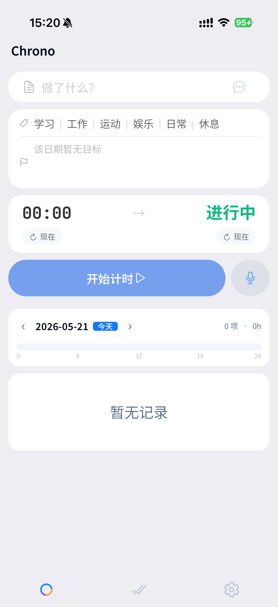
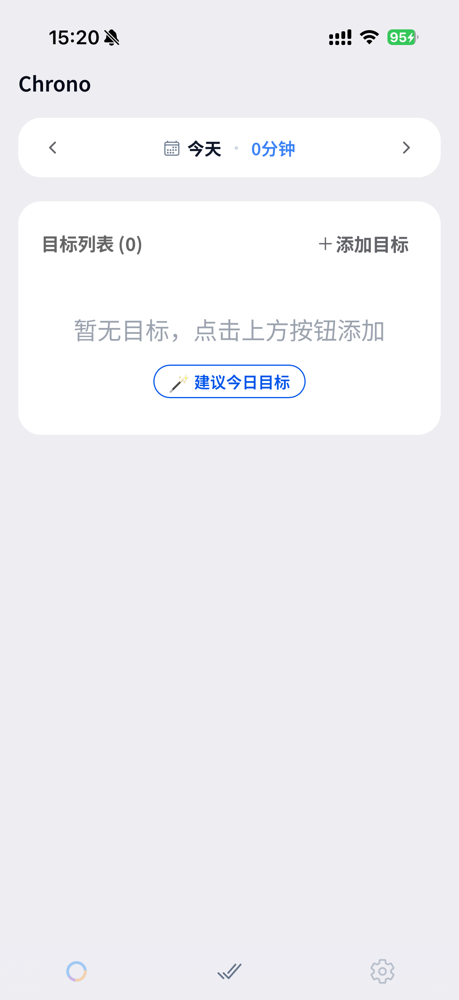

# Chrono

<p align="center">
  
</p>

<h1 align="center">Chrono</h1>

<p align="center">
  A cross-platform personal time tracker for daily logs, goals, analytics, and AI-assisted review.
</p>

<p align="center">
  <a href="https://github.com/yxr620/chrono/actions/workflows/ci.yml"></a>
  
  
  
</p>

<p align="center">
  <a href="#download">Download</a>
  &middot;
  <a href="#quick-start">Quick Start</a>
  &middot;
  <a href="docs/architecture.md">Architecture</a>
  &middot;
  <a href="docs/development.md">Development Guide</a>
</p>

Chrono 是一个面向个人使用的时间追踪应用。它把“今天做了什么”“时间花在哪里”“目标投入是否稳定”放在同一个工作流里，支持实时计时、手动补录、目标管理、时间轴回顾、多端同步和 AI 时间助手。

默认情况下，Chrono 的核心数据保存在本地 IndexedDB 中。同步、托管服务和 AI 助手都是可选能力，可以按需配置。

<p align="center">
  
  
</p>

## Project Status

Chrono 目前处于 active development 阶段，核心 Web / Android / macOS 工作流可用。iOS 工程已存在，但仍按实验性平台处理。

| Area | Status |
| --- | --- |
| Web app | Supported |
| Android app | Supported via Capacitor |
| macOS app | Supported via Electron |
| iOS app | Experimental |
| Managed sync / AI services | Optional backend in `server/` |

## Features

- **Daily time logging**: 支持实时计时和手动添加，适合快速记录一天的时间流水。
- **24-hour timeline**: 用时间轴查看一天的记录分布，快速发现空档和高投入时段。
- **Goal tracking**: 支持每日目标、目标投入统计和月历热力图。
- **Categories**: 内置学习、工作、运动、娱乐、日常、休息等分类，并支持自定义。
- **Data portability**: 支持 JSON 导入 / 导出，可用于备份、迁移和合并数据。
- **Optional multi-device sync**: 基于 oplog + snapshot 的同步架构，可接入阿里云 OSS。
- **Desktop analytics**: 在 macOS / Web 宽屏场景提供 KPI、趋势、类别分布和目标分析。
- **AI time assistant**: 支持自然语言查询和 Function Calling，可用于复盘、统计和建议生成。

## Download

| Platform | How to get it |
| --- | --- |
| Android | Download APK from [GitHub Releases](https://github.com/yxr620/chrono/releases). |
| macOS | Download DMG from [GitHub Releases](https://github.com/yxr620/chrono/releases), or build locally with Electron. |
| Web | Run locally with Vite, or deploy the generated `dist/` directory. |

## Quick Start

```bash
git clone https://github.com/yxr620/chrono.git
cd chrono
npm install
npm run dev
```

The development server starts at:

```text
http://localhost:5173
```

## Configuration

Chrono works without cloud configuration. Optional capabilities can be enabled through environment variables:

```bash
cp .env.example .env.local
```

| Capability | Required configuration | Documentation |
| --- | --- | --- |
| Managed sync and AI | `VITE_AUTH_API_URL` | [server/README.md](server/README.md) |
| BYO Aliyun OSS sync | `VITE_OSS_REGION`, `VITE_OSS_BUCKET`, access keys | [docs/sync.md](docs/sync.md) |
| BYO AI assistant | `VITE_AI_PROVIDER_ID`, `VITE_AI_MODEL`, `VITE_AI_BASE_URL`, `VITE_AI_API_KEY` | [docs/ai-assistant.md](docs/ai-assistant.md) |

## Development

Common commands:

```bash
npm run dev              # Start the web development server
npm run build            # Type-check and build the web app
npm run lint             # Run ESLint
npm run test:app-checks  # Run application-level tests
npm run ai:debug         # Debug AI assistant function calling
```

Platform-specific workflows are documented in [docs/development.md](docs/development.md), including Android builds, Electron builds, APK release steps, and troubleshooting.

## Architecture

Chrono uses a local-first architecture:

| Layer | Technology |
| --- | --- |
| UI | React 18, Ionic React 8, TypeScript |
| State | Zustand 5 |
| Storage | Dexie.js and IndexedDB |
| Build | Vite 7 |
| Mobile | Capacitor 7 |
| Desktop | Electron 26 |
| Charts | Recharts |
| Fonts | Local Fontsource packages for Noto Sans SC and JetBrains Mono |

High-level structure:

```text
src/
├── components/     # Screens and UI components
├── stores/         # Zustand stores
├── services/       # DB, sync, data service, OSS, AI services
├── config/         # Category colors and app configuration
├── hooks/          # React hooks
├── types/          # TypeScript types
└── utils/          # Shared utilities

android/            # Capacitor Android project
electron/           # Electron macOS project
ios/                # Experimental iOS project
server/             # Optional managed services backend
docs/               # Architecture and development documentation
```

For deeper details, see [docs/architecture.md](docs/architecture.md).

## Documentation

| Document | Description |
| --- | --- |
| [Development Guide](docs/development.md) | Local setup, Android / Electron builds, release workflow, FAQ |
| [Architecture](docs/architecture.md) | App architecture, layout, data model, store and service boundaries |
| [Sync](docs/sync.md) | Multi-device sync design, OSS configuration, conflict handling |
| [AI Assistant](docs/ai-assistant.md) | Function Calling design and AI provider configuration |
| [Action Registry](docs/action-registry.md) | AI action registry and callable tool contract |

## Data and Privacy

Chrono is designed as a local-first app. Time entries, goals, categories, and settings are stored locally unless you explicitly configure sync or managed services.

When AI features are enabled, relevant user requests and tool-call context may be sent to the configured AI provider. Keep AI configuration disabled if you want the app to remain fully local.

## Contributing

This repository is currently maintained as a personal project. Issues and focused pull requests are welcome, especially for reproducible bugs, platform build fixes, documentation improvements, and small feature refinements.

Before opening a large feature PR, please start with an issue describing the problem, expected behavior, and target platform.

## License

No open-source license has been declared yet. Until a license is added, all rights are reserved by the repository owner.
