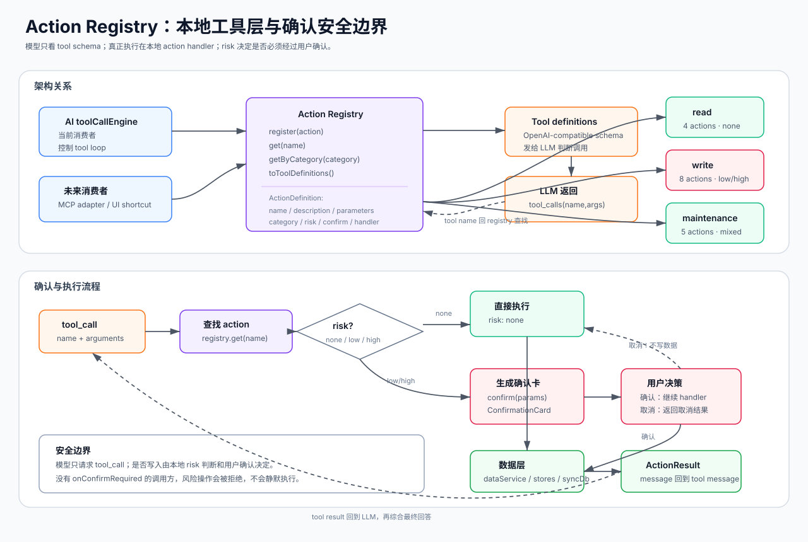

# Action Registry

Action Registry 是 AI 助手的本地工具层。它把「模型想做什么」和「应用真正怎么读写数据」隔开：模型只看到 OpenAI-compatible tool schema，实际执行由本地 action handler 完成。

最重要的理解是：**Registry 不负责聊天，也不负责决定何时调用工具；它负责登记工具、生成 schema、按风险执行或拦截操作，并把结果交回 `toolCallEngine`。**

## 架构图



## 它在 AI 对话中的位置

完整对话流程见 [AI 助手对话流程](ai-assistant.md)。Registry 位于 `toolCallEngine` 和数据层之间：

1. `toolCallEngine` 启动时调用 `actionRegistry.toToolDefinitions()`。
2. LLM 在 thinking 阶段返回 `tool_calls`。
3. `toolCallEngine` 用 tool name 调 `actionRegistry.get(name)`。
4. Registry 返回自描述的 `ActionDefinition`。
5. 引擎根据 `risk` 决定直接执行、弹确认卡片，或拒绝无确认机制的写入。
6. action handler 返回 `ActionResult.message`，作为 tool message 进入下一轮 LLM 综合。

## ActionDefinition 心智模型

每个 action 都是一个小型、可描述、可执行的本地能力：

```typescript
interface ActionDefinition {
  name: string;
  description: string;
  category: 'read' | 'write' | 'maintenance';
  risk: 'none' | 'low' | 'high';
  parameters: Record<string, unknown>;
  handler: (params) => Promise<ActionResult>;
  confirm?: (params) => Promise<ConfirmationCard>;
}
```

字段含义：

| 字段 | 给谁用 | 作用 |
|---|---|---|
| `name` | LLM + registry | tool name，必须唯一 |
| `description` | LLM | 帮模型判断何时调用 |
| `parameters` | LLM | JSON Schema，限制和解释入参 |
| `category` | 开发者 + prompt | 区分读取、写入、维护 |
| `risk` | `toolCallEngine` | 决定是否需要用户确认 |
| `confirm` | UI 确认流程 | 把参数转换成用户能看懂的变更卡片 |
| `handler` | 本地执行 | 读写 IndexedDB、stores、syncDb，返回自然语言结果 |

## 三类 Action

| 分类 | 数量 | 风险特点 | 用途 |
|---|---:|---|---|
| read | 4 | `risk: none` | 查询时间记录、分类、目标、memo |
| write | 8 | `risk: low/high` | 新增、修改、删除、合并、拆分记录或目标 |
| maintenance | 5 | `none/low/high` 混合 | 检测重叠/空隙/异常，自动分类，批量修改 |

当前注册入口是 `src/services/actions/index.ts`，所有 action 文件都在 `src/services/actions/{read,write,maintenance}/` 下。

## 确认流程

确认流程是 Registry 最关键的安全设计。它只在 `risk !== 'none'` 时触发。

```text
LLM tool_call
  -> actionRegistry.get(name)
  -> risk === none ? handler(params)
  -> risk !== none ? confirm(params)
  -> AIAssistant 显示 ConfirmationCard
  -> 用户确认：handler(params)
  -> 用户取消：返回“用户取消了此操作”
  -> ActionResult.message 作为 tool result 回到模型
```

几个边界要记住：

- **模型不能绕过确认。** 确认由本地 `toolCallEngine` 根据 action risk 强制执行。
- **没有确认 UI 时不会静默写入。** 如果调用方没有提供 `onConfirmRequired`，风险操作会被拒绝。
- **取消也是一种 tool result。** 用户取消后，模型会收到取消信息，并在最终回答中说明未执行。
- **确认卡片必须面向用户。** `confirm()` 的职责不是复述 JSON，而是把参数转成可理解的变更清单。

## 数据变更链路

写入类 handler 必须沿用 Chrono 的数据变更链路：

```typescript
await dataService.entries.add(newEntry);
await useEntryStore.getState().loadEntries();
autoPush('action: add_entry');
```

原因是：

- `dataService` 经 `syncDb` 写入，能维护 `version / deviceId / syncStatus / deleted`。
- store reload 让页面状态与 IndexedDB 一致。
- `autoPush()` 让可选同步及时感知本地修改。

读取可以直接查 `db`，但必须过滤 `deleted` 记录。

## Action 列表速查

### Read

| Action | 作用 |
|---|---|
| `query_time_entries` | 查询时间记录并统计时长 |
| `list_categories` | 列出活动分类 |
| `list_goals` | 列出日期范围内目标 |
| `search_memos` | 按日期和关键词检索 memo |

### Write

| Action | Risk | 作用 |
|---|---|---|
| `add_entry` | low | 新增时间记录 |
| `update_entry` | low | 修改时间记录 |
| `delete_entry` | high | 软删除时间记录 |
| `merge_entries` | high | 合并多条记录 |
| `split_entry` | low | 拆分记录 |
| `add_goal` | low | 新增目标 |
| `update_goal` | low | 修改目标 |
| `delete_goal` | high | 软删除目标 |

### Maintenance

| Action | Risk | 作用 |
|---|---|---|
| `find_overlaps` | none | 检测时间重叠 |
| `find_gaps` | none | 检测空隙 |
| `find_anomalies` | none | 检测异常记录 |
| `auto_categorize` | low | 根据历史推断未分类记录 |
| `batch_update` | high | 批量修改符合条件的记录 |

## 新增 Action 的检查清单

1. 在 `read/`、`write/` 或 `maintenance/` 下新增一个 action 文件。
2. 写清楚 `description` 和 `parameters`，让模型知道何时调用、怎么传参。
3. 正确设置 `risk`：只读为 `none`，会改数据的通常是 `low` 或 `high`。
4. 写入或高风险维护操作实现 `confirm()`，把参数转成用户能确认的 `ConfirmationCard`。
5. handler 走 `dataService -> store reload -> autoPush`，不要直接绕过同步链路写 `db`。
6. 在 `src/services/actions/index.ts` 注册 action。
7. 用 AI 页面或 `npm run ai:debug` 走一遍：模型是否选对 action，确认卡片是否可理解，tool result 是否足够模型生成最终回答。

## 调试重点

| 现象 | 优先检查 |
|---|---|
| 模型不调用工具 | action `description` 是否清楚，system prompt 是否要求查数据 |
| 参数不稳定 | `parameters` schema 是否限制太松，字段名是否贴近日常语言 |
| 确认卡片看不懂 | `confirm()` 是否只展示了原始 JSON，应改成变更清单 |
| 写入后 UI 不刷新 | handler 是否漏了 store reload |
| 多设备不同步 | handler 是否绕过 `dataService` 或漏了 `autoPush()` |
| 最终回答没用工具结果 | `ActionResult.message` 是否太结构化或信息不足 |
