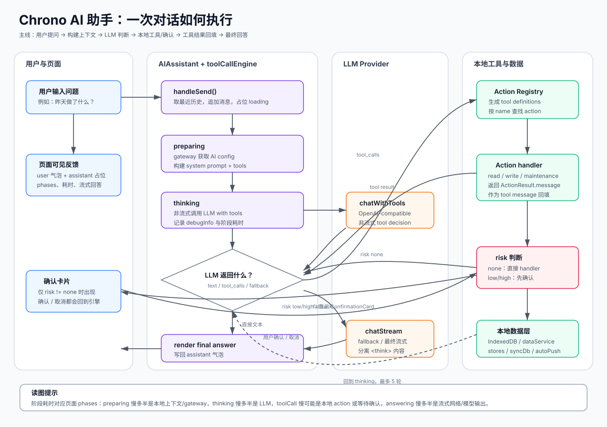

# AI 助手对话流程

AI 助手是 Chrono 的桌面端自然语言入口。它不是一个单纯的聊天框，而是一个「对话 UI + tool calling 引擎 + 本地数据工具 + 可选写入确认」组成的流程系统。

理解它时，先抓住一句话：**用户发一句话，`toolCallEngine` 会先判断是否需要本地数据；需要就调用 Action，再把结果交回模型组织回答；如果要改数据，必须先让用户确认。**

## 总览图



## 用户实际看到的流程

一次提问在页面上会表现为下面几件事：

1. 用户消息立即出现在右侧气泡。
2. 系统创建一个空的 assistant 气泡，并开始显示阶段列表。
3. 阶段列表通常从 `准备上下文` 到 `思考中`，如果需要数据，会出现 `查询数据`；每个阶段旁会显示耗时。
4. 如果模型输出 `<think>`，页面会把它放进「思考过程」折叠区。
5. 如果模型需要修改数据，页面会额外出现确认卡片；用户确认前，工具不会真正执行写入。
6. 最终回答会流式进入 assistant 气泡；完成后可以点「复制全部」复制阶段、思考和回答。
7. 用户点「停止生成」时，当前网络请求会 abort；如果此时正在等确认，会先按取消处理，避免对话卡住。

这个页面本身就是最重要的人测接口：阶段名告诉你当前卡在哪一层，耗时告诉你慢在哪一层，折叠的 debugInfo 可以看到 system prompt、发给模型的消息和工具结果。

## 主要模块

| 模块 | 位置 | 职责 |
|---|---|---|
| 对话页面 | `src/components/AIAssistant/AIAssistant.tsx` | 输入、消息气泡、阶段展示、停止生成、确认卡片 |
| 对话状态 | `src/stores/aiStore.ts` | provider 配置、消息列表、每条消息的 phases / thinking / loading |
| 调用引擎 | `src/services/ai/toolCallEngine.ts` | 构建 prompt、组织历史、控制 tool-calling 循环、处理 fallback |
| LLM 客户端 | `src/services/ai/llmClient.ts` | OpenAI-compatible HTTP 请求、SSE 流式解析、`<think>` 分离 |
| Gateway | `src/services/gateway/` | 根据 feature mode 选择 BYO 或 Managed AI 配置 |
| Action Registry | `src/services/actions/` | 注册本地工具，提供 tool schema，执行 read/write/maintenance action |

## 执行主线

### 1. UI 收到输入

`AIAssistant` 做三件事：

- 从 `aiStore.messages` 取最近 6 条有效历史，构造给模型的上下文。
- 追加一条 user message，再追加一条 loading 状态的 assistant placeholder。
- 创建 `AbortController`，调用 `runToolCallLoop()`。

历史只取用户消息和已经完成的 assistant 文本回答；loading、error、空内容不会进入下一轮模型上下文。

### 2. preparing：构建本轮上下文

`toolCallEngine` 先取 AI client config：

- BYO：从 `aiStore.config` 读取用户自己的 `baseURL / apiKey / model`。
- Managed：从 Chrono 后端地址拼出 `<VITE_AUTH_API_URL>/v1`，用登录 JWT 作为 Bearer token。

然后它构建 system prompt。这个 prompt 不直接塞入全部时间数据，只包含：当前日期、当前分类列表、工具使用规则、回答规则、写操作规则。真实时间记录只在模型明确调用工具后才从本地 IndexedDB 查询。

### 3. thinking：第一次问模型

引擎把 `system + history + 当前用户问题` 以及所有 Action 生成的 tool definitions 发给 LLM。这里是非流式调用，因为要先看模型是否返回 `tool_calls`。

thinking 有三个重要分支：

| LLM 响应 | 引擎行为 | 用户看到 |
|---|---|---|
| 返回普通文本，无 `tool_calls` | 直接把文本作为最终回答 | `思考中` 后开始显示回答；没有额外 `生成回答` 阶段 |
| 返回 `tool_calls` | 进入 toolCall 阶段，本地执行工具 | 出现 `查询数据` 或具体 action 描述 |
| 返回空内容，或 provider 明确不支持 tools | 进入 answering fallback | 出现 `生成回答` 阶段，改用无 tools 的流式生成 |

### 4. toolCall：执行本地工具

当模型返回 `tool_calls` 时，引擎会把每个 tool call 映射到 Action Registry 中同名的 action。

- `risk: none` 的读取/诊断 action 会直接执行。
- `risk: low` 或 `risk: high` 的写入/维护 action 会先生成确认卡片。
- 如果调用方没有提供 `onConfirmRequired`，高风险 action 会被拒绝，不会静默写入。

确认流程是 Action Registry 的核心安全边界，详见 [Action Registry 文档：确认流程](action-registry.md#确认流程)。AI 助手这里只负责展示 `ConfirmationCard` 并把用户选择 resolve 回引擎。

工具执行完成后，handler 返回 `ActionResult.message`。引擎把这个结果作为 `role: tool` 的消息追加到本轮消息列表，再回到 thinking，让模型基于工具结果综合回答。这个循环最多 5 轮。

### 5. answering：兜底流式生成

只有在 thinking 阶段没有产出最终文本时，才会进入 answering。它使用 `chatStream()` 流式调用模型，并把 token 逐段写入 assistant 气泡。

这意味着页面上的阶段不是固定四步。常见情况是：

- 简单问题：`准备上下文 -> 思考中 -> 最终回答`
- 查询数据：`准备上下文 -> 思考中 -> 查询数据 -> 思考中 -> 最终回答`
- provider 不支持 tools：`准备上下文 -> 思考中 -> 生成回答`
- 写入操作：`准备上下文 -> 思考中 -> 确认卡片 -> 查询/写入 -> 思考中 -> 最终回答`

## 分支细节

### 直接回答

适用于闲聊、解释性问题，或者模型认为不需要本地数据的问题。风险是：如果用户问的是时间记录，而模型没有调用工具，答案可能缺少数据依据。调试时看 thinking 阶段的 debugInfo，确认发给模型的 tools 是否完整，以及 prompt 是否明确要求查询。

### 读取型查询

典型问题是「昨天做了什么」「本周花了多少时间在项目 X」。模型应调用 `query_time_entries`、`list_goals`、`list_categories` 或 `search_memos`。工具结果只留在本地消息链路里，用于下一轮模型综合回答。

### 写入或维护

典型问题是「帮我新增一条记录」「删除刚才那条」「整理今天重叠的记录」。模型会先尽量查询对象，再调用写入/维护 action。真正修改前会弹确认卡片；用户取消时，取消结果也会回到模型，让最终回答能说明没有执行。

### 错误和取消

- 网络/API 错误：assistant 气泡显示错误文本，并标记 `error`。
- 用户停止：AbortController 中断请求；如果正在等待确认，会先 resolve(false)。
- action handler 抛错：引擎把异常包装为失败的 tool result，让模型仍能给用户一个解释。

## 数据与隐私边界

AI 助手不会把整个 IndexedDB 上传给模型。默认发送给模型的是 prompt、最近对话历史、当前问题、tool schema。只有当模型调用某个 action 时，对应 action 的结果会作为 tool message 发回模型。因此，实际暴露的数据范围由 action handler 的返回文本决定。

## 调试与测试入口

人工测试优先看对话页面：阶段、耗时、折叠 debugInfo 和确认卡片就是最直接的反馈面。

机器/半自动测试入口：

- `npm run ai:debug`：CLI 版对话，可通过 `--data <file>` 加载导出的数据，在终端观察 phase、tool、最终回答。
- `npx eslint src/components/AIAssistant/AIAssistant.tsx src/stores/aiStore.ts`：改动对话 UI 或 store 后的最小 lint 检查。
- Action handler 适合用 `fake-indexeddb` 做单测；tool-calling 主循环适合通过 mock LLM 注入固定 `tool_calls` 做回归测试。

阶段耗时的定位方式：

| 慢的阶段 | 通常说明 |
|---|---|
| preparing | 本地 DB 类别读取或 gateway 配置获取慢 |
| thinking | LLM 非流式请求慢，或 provider 响应慢 |
| toolCall | 本地 action、确认等待、DB 查询/写入慢 |
| answering | 流式输出慢，通常是 provider 或网络问题 |

## 配置速查

AI 有两种模式，模式存储在 `localStorage.chrono_feature_modes`。

| 模式 | 凭据来源 | 适用 |
|---|---|---|
| BYO | 用户在应用内或 `.env` 填入 LLM API Key | 自部署 / 不愿登录 |
| Managed | 登录 Chrono 后端，由后端代理 `/v1/chat/completions` | 需要 `VITE_AUTH_API_URL` 与白名单 |

BYO `.env` 示例：

```env
VITE_AI_PROVIDER_ID=qwen
VITE_AI_BASE_URL=https://dashscope.aliyuncs.com/compatible-mode/v1
VITE_AI_API_KEY=sk-...
VITE_AI_MODEL=qwen3.6-max-preview
```

Managed 只需要前端设置 `VITE_AUTH_API_URL=https://chrono-api.fcv3.<region>.fcapp.run`。后端配置 `AI_API_KEY`、`AI_BASE_URL`、`AI_MODEL`、`ALLOWED_AI_EMAILS`，实现位于 `server/src/features/ai.ts`。
