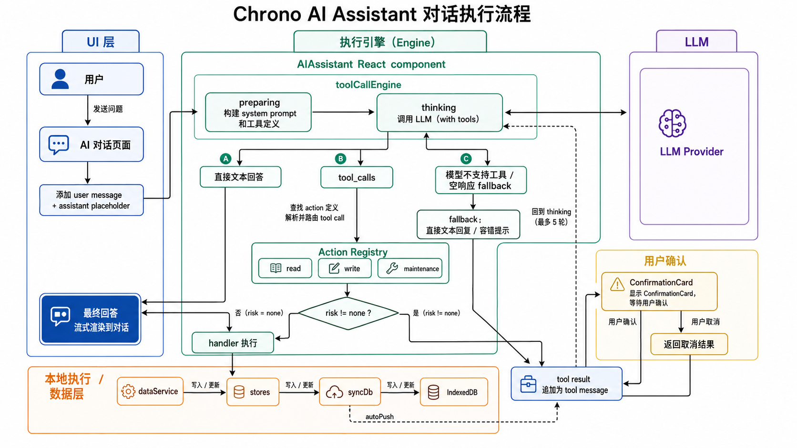
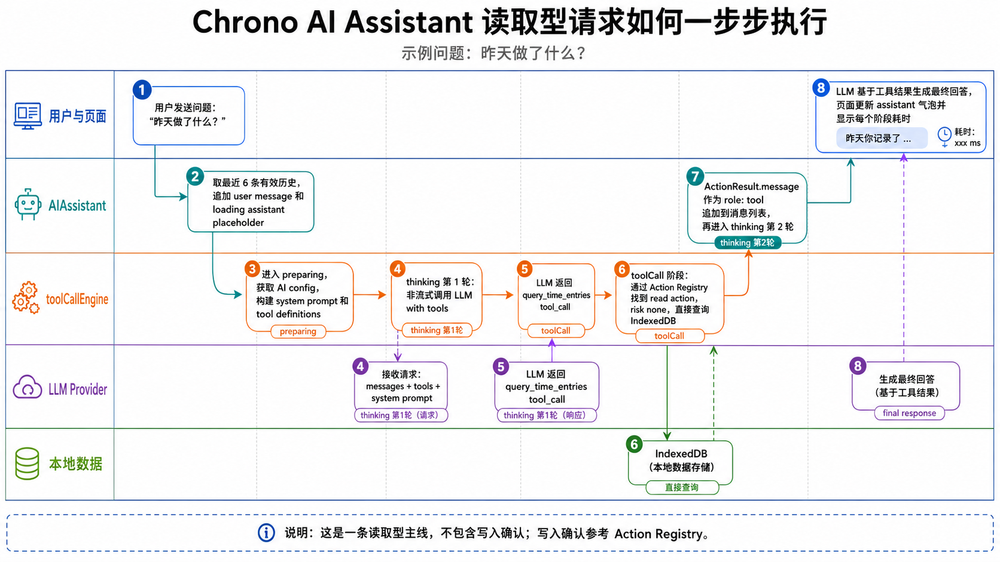

# AI 助手对话流程

AI 助手是 Chrono 的桌面端自然语言入口。它不是一个单纯的聊天框，而是一个「对话 UI + tool calling 引擎 + 本地数据工具 + 可选写入确认」组成的流程系统。

理解它时，先抓住一句话：**`toolCallEngine` 负责构建 prompt + 组织历史，然后委托给 `streamingEngine` 用 Vercel AI SDK 的 `streamText` 跟模型保持一条流式连接；`streamingEngine` 把 `fullStream` 的事件翻译成阶段行、文字增量和工具调用展示；写入操作必须经过用户确认。**

自 2026-05-19 起，`streamingEngine` 从 `toolCallEngine` 抽出，成为 AI Assistant 和 QuickCapture 共用的纯事件翻译层。QuickCapture 通过 `parseTranscript` 直接调用它（`maxSteps: 1` + inline add_entry shim tool），让"自动补录"也能复用同样的过程可视化。

> 自 2026-05-16 起，AI 客户端层从手撸 SSE 切换到了 **Vercel AI SDK** (`ai@5.x` + `@ai-sdk/openai-compatible`)。文字与 tool_call 在同一条流里出现，工具执行完后无缝继续 stream（不再有"非流式 thinking → 流式 answering"的二段式）。详见 `docs/superpowers/specs/2026-05-16-streaming-ai-assistant-design.md`。

## 总览图



## 用户实际看到的流程

一次提问在页面上会表现为下面几件事：

1. 用户消息立即出现在右侧气泡。
2. 系统创建一个空的 assistant 气泡，并开始显示阶段列表。
3. 阶段列表按出现顺序排列，最多六种 key：`准备上下文 / 请求模型 / 模型推理中 / 构造工具调用 / 调用工具 / 生成回答`。每个阶段旁会显示 ✓（完成）/ ✗（失败）/ spinner（进行中）和耗时。多 step 流程里 `请求模型 / 模型推理中 / 构造工具调用 / 调用工具` 会按 step 顺序重复出现。
4. 大多数行右侧有 ▶ 可展开看本步的结构化 debugInfo（MODEL REQUEST 元信息、REASONING 当前 step 的推理文本、TOOL INPUT 参数、TOOL CALL 输入+输出）。活跃的 `模型推理中` 行默认展开，让推理文本实时流出来；结束后自动折叠。
5. 如果模型需要修改数据，页面会额外出现确认卡片；用户确认前，工具不会真正执行写入。
6. 最终回答会流式进入 assistant 气泡；完成后可以点「复制全部」把阶段日志（含每行 debug）和最终回答一起复制走。
7. 用户点「停止生成」时，当前网络请求会 abort；如果此时正在等确认，会先按取消处理，避免对话卡住。

这个页面本身就是最重要的人测接口：阶段名告诉你当前卡在哪一层，耗时告诉你慢在哪一层，折叠的 debugInfo 会按结构展示 system prompt、模型请求 messages、tools 声明、模型响应和工具结果。

## 主要模块

| 模块 | 位置 | 职责 |
|---|---|---|
| 对话页面 | `src/components/AIAssistant/AIAssistant.tsx` | 输入、消息气泡、阶段展示、停止生成、确认卡片 |
| 对话状态 | `src/stores/aiStore.ts` | provider 配置、消息列表、每条消息的 phases / loading / 结构化 debugInfo |
| 流式引擎 | `src/services/ai/streamingEngine.ts` | 纯事件翻译层：消费 SDK `fullStream`，把事件 → 阶段行 / 文字增量 / 工具调用回调。被 AI Assistant 和 QuickCapture 共用 |
| AI Assistant 入口 | `src/services/ai/toolCallEngine.ts` | 构建系统 prompt、组织历史、配置 `onConfirmRequired` 通道，然后委托给 `streamingEngine.runStreamingToolCallLoop` |
| LLM 客户端 | `src/services/ai/llmClient.ts` | 基于 `@ai-sdk/openai-compatible` 构造 `LanguageModel`；导出 `streamChatWithTools`（供 `streamingEngine` 使用）和 `generateChatOnce`（备用一次性入口，当前无调用方） |
| Gateway | `src/services/gateway/` | 根据 feature mode 选择 BYO 或 Managed AI 配置 |
| Action Registry | `src/services/actions/` | 注册本地工具，提供 tool schema，执行 read/write/maintenance action |

## 执行主线

### 1. UI 收到输入

`AIAssistant` 做三件事：

- 从 `aiStore.messages` 取最近 6 条有效历史，构造给模型的上下文。
- 追加一条 user message，再追加一条 loading 状态的 assistant placeholder。
- 创建 `AbortController`，调用 `runToolCallLoop()`。

历史只取用户消息和已经完成的 assistant 文本回答；loading、error、空内容不会进入下一轮模型上下文。

### 2. preparing：构建本轮上下文

`toolCallEngine` 先取 AI client config：

- BYO：从 `aiStore.config` 读取用户自己的 `baseURL / apiKey / model`。
- Managed：从 Chrono 后端地址拼出 `<VITE_AUTH_API_URL>/v1`，用登录 JWT 作为 Bearer token。

然后它构建 system prompt。这个 prompt 不直接塞入全部时间数据，只包含：当前日期、当前分类列表、工具使用规则、回答规则、写操作规则。真实时间记录只在模型明确调用工具后才从本地 IndexedDB 查询。

### 3. requesting / reasoning / composingTool / answering：消费 fullStream

`streamingEngine` 调用 `streamChatWithTools({ model, messages, tools, maxSteps: 5, abortSignal })`，订阅 SDK 返回的 `result.fullStream` —— 一个 `AsyncIterable<...>`，按时间顺序产出各种事件。`streamingEngine` 不再自己跑 round 循环：SDK 内部根据 `stopWhen: stepCountIs(5)` 自动处理「调模型 → 看到 tool_call → 执行 execute → 再调模型」的多轮逻辑。

`streamingEngine` 的事件→UI 阶段映射（`onPhase` 的 update-in-place 分支保证同一 step 内多次写 debugInfo 时刷新最后一行而不堆出新行）：

| SDK 事件 | 引擎动作 | 用户看到 |
|---|---|---|
| 流前（不依赖 SDK 事件） | 先 emit `requesting` 行，挂上 MODEL REQUEST debugInfo（model / messages / tools） | 第一条 `请求模型`，作为不支持 `start-step` 的 provider 的兜底 |
| `start-step`（continuation） | `requestingEmittedThisStep` 标志已被 `finish-step` 重置，emit 新一行 `请求模型 (继续)` | step≥2 时再次出现 `请求模型 (继续)` |
| `reasoning-delta` | 首次 emit `reasoning` 行；累计 `stepReasoningBuf`，并把累计文本作为 `REASONING (本步)` debugInfo 写回 | `模型推理中` 行展开时推理文本一字一字流出（Qwen instruct / GLM-flash 等不发 reasoning 的模型不会出现此行） |
| `tool-input-start` | emit `composingTool` 行，detail 写工具名 | 出现 `构造工具调用：query_time_entries` |
| `tool-call` | 给 `composingTool` 行补上 TOOL INPUT debugInfo（完整参数 JSON），再 emit `toolCall` 行，detail 写参数摘要 | 出现 `查询记录 (2026-05-15 ~ 2026-05-16)` |
| `tool-result` | 给当前 `toolCall` 行补上 TOOL CALL debugInfo（input + output + success） | 行展开能看到调用结果 |
| `tool-error` | 给 `toolCall` 行补 debugInfo 并标记 `failed=true` | 该行显示 `✗` 替换 `✓` |
| `text-delta` | 第一次出现时 emit `answering` 行；持续 `onChunk(delta)` | 文字流式写入 assistant 气泡 |
| `finish-step` | step 结束：递增 stepIdx、重置 `requestingEmittedThisStep` / `reasoningEmittedThisStep`、清空 `stepReasoningBuf` | — |
| `finish` | 结束整次调用 | 最后一行耗时定格 |
| `error` | 抛错；catch 里若是 unsupported-tools 错误，转成「请切换支持 function calling 的模型」 | assistant 气泡显示错误文本 |

### 4. toolCall：执行本地工具

`actionRegistry.toSdkTools(ctx)` 把所有注册过的 action 翻译成 SDK 的 `Tool` 字典。每个 `Tool` 的 `execute(args)` 函数就是 action.handler 的包装：

- `risk: 'none'`（读取/诊断）：直接 `await action.handler(args)` 并返回结果给 SDK
- `risk: 'low' | 'high'`（写入/维护）：先 `await ctx.onConfirmRequired(card)`；用户点取消则返回 `{ success: false, message: '用户取消了此操作。' }`，SDK 会把这个结构 JSON 化作为 tool result 喂回模型，模型决定怎么继续
- 调用方没有提供 `onConfirmRequired`：高风险 action 被拒绝，返回 `{ success: false, message: '...调用方未提供用户确认机制...' }`，绝不静默写入

确认流程是 Action Registry 的核心安全边界，详见 [Action Registry 文档：确认流程](action-registry.md#确认流程)。

SDK 串行执行 `execute`，所以多 tool 在同一轮被调时会按 index 顺序逐个走完。这一行为对 confirmation UI 友好（一次只弹一张卡）。

### 5. answering：工具后的最终回答

工具结果回到模型，模型继续输出 —— SDK 把那一段输出当作新一批 `text-delta` 事件发出，`streamingEngine` 在收到工具后的第一个 `text-delta` 时 push `answering` 阶段，开始累加文字。

阶段顺序通常是（推理模型；instruct 模型把 `模型推理中` 行省略）：

- 简单问题：`准备上下文 → 请求模型 → 模型推理中 → 生成回答`
- 单次查询：`准备上下文 → 请求模型 → 模型推理中 → 构造工具调用 → 调用工具 → 请求模型 (继续) → 模型推理中 → 生成回答`
- 多 step 查询：每个 step 自带 `请求模型 (继续) → (模型推理中) → 构造工具调用 → 调用工具` 子序列
- provider 不支持 tools：`准备上下文 → 请求模型 → ❌ 当前模型不支持工具调用，请切换…`（不再静默走无工具兜底，而是显式提示）
- 写入操作：在 `调用工具` 之前插入确认卡片；用户取消时取消结果会作为 tool result 回流到模型

> **二段式废除**：旧实现里 `thinking` 是非流式调用、`answering` 才流式。现在 SDK 事件驱动真流式，文字、reasoning 与 tool_call 在同一条流里交错，引擎据此把每个 step 拆成独立的 `请求模型 / 模型推理中 / 构造工具调用 / 调用工具` 行——每行只承担一个语义。

## 典型步骤图：读取型问题

总览图解释的是所有条件分支。下面这张图只看一条最常见的顺序路径：用户问「昨天做了什么」，AI 需要读取本地时间记录，然后基于工具结果回答。



这条路径的关键点是：`请求模型` 行承载 MODEL REQUEST debug；推理模型会插入 `模型推理中` 行并实时流式展示推理；模型决定调用工具后，先出现 `构造工具调用：<name>` 行（其 debug 显示完整参数 JSON），然后是 `调用工具` 行执行本地查询并把结构化结果交回 SDK；SDK 自动继续流，进入第二个 step（`请求模型 (继续) → 模型推理中 → 生成回答`）。写入型请求会在 `调用工具` 中插入确认卡片，确认细节放在 [Action Registry 文档：确认流程](action-registry.md#确认流程)。

> 流程图的 PNG 还反映的是 2026-05-16 之前的「非流式 thinking + 流式 answering」结构。文字描述以这份 Markdown 为准。


## 分支细节

### 直接回答

适用于闲聊、解释性问题，或者模型认为不需要本地数据的问题。风险是：如果用户问的是时间记录，而模型没有调用工具，答案可能缺少数据依据。调试时展开 `请求模型` 行看 MODEL REQUEST debug（model、messages 数、tools 数），再看 `模型推理中` 行的推理文本，确认 prompt 是否明确要求查询。SDK 把请求详情写入 `result.request` / `result.response`，引擎把这些封装为 `createTextDebug` 挂在对应行的 debugInfo 上。

### 读取型查询

典型问题是「昨天做了什么」「本周花了多少时间在项目 X」。模型应调用 `query_time_entries`、`list_goals`、`list_categories` 或 `search_memos`。工具结果只留在本地消息链路里，用于下一轮模型综合回答。

### 写入或维护

典型问题是「帮我新增一条记录」「删除刚才那条」「整理今天重叠的记录」。模型会先尽量查询对象，再调用写入/维护 action。真正修改前会弹确认卡片；用户取消时，取消结果也会回到模型，让最终回答能说明没有执行。

### 错误和取消

- 网络/API 错误：assistant 气泡显示错误文本，并标记 `error`。
- 用户停止：AbortController 中断请求；如果正在等待确认，会先 resolve(false)。
- action handler 抛错：引擎把异常包装为失败的 tool result，让模型仍能给用户一个解释。

## 数据与隐私边界

AI 助手不会把整个 IndexedDB 上传给模型。默认发送给模型的是 prompt、最近对话历史、当前问题、tool schema。只有当模型调用某个 action 时，对应 action 的结果会作为 tool message 发回模型。因此，实际暴露的数据范围由 action handler 的返回文本决定。

## 调试与测试入口

人工测试优先看对话页面：阶段、耗时、折叠 debugInfo 和确认卡片就是最直接的反馈面。

机器/半自动测试入口：

- `npx eslint src/components/AIAssistant/AIAssistant.tsx src/stores/aiStore.ts`：改动对话 UI 或 store 后的最小 lint 检查。
- Action handler 适合用 `fake-indexeddb` 做单测；tool-calling 主循环适合通过 mock LLM 注入固定 `tool_calls` 做回归测试。

阶段耗时的定位方式：

| 慢的阶段 | 通常说明 |
|---|---|
| preparing | 本地 DB 类别读取或 gateway 配置获取慢 |
| requesting | 首个 token 迟迟不出 → provider 首包延迟（TTFT）高，或 Managed 后端 FC 触发器是 buffer 模式（详见 `server/RUNBOOK.md` 的 streaming-relay 章节） |
| reasoning | 模型推理本身耗时（推理模型常态），或网络中段卡顿；展开行可看到当前已生成的推理文本是否在动 |
| composingTool | 罕见，通常 < 1s；明显变慢说明模型在反复 retry 参数 schema |
| toolCall | 本地 action、确认等待、DB 查询/写入慢；通常 ms 级，若达秒级要看 action 实现 |
| answering | token 流出后变慢 → provider 解码慢，或 Managed 后端 FC 触发器仍是 buffer 模式 |

## 配置速查

AI 有两种模式，模式存储在 `localStorage.chrono_feature_modes`。

| 模式 | 凭据来源 | 适用 |
|---|---|---|
| BYO | 用户在应用内或 `.env` 填入 LLM API Key | 自部署 / 不愿登录 |
| Managed | 登录 Chrono 后端，由后端代理 `/v1/chat/completions` | 需要 `VITE_AUTH_API_URL` 与白名单 |

BYO `.env` 示例：

```env
VITE_AI_PROVIDER_ID=qwen
VITE_AI_BASE_URL=https://dashscope.aliyuncs.com/compatible-mode/v1
VITE_AI_API_KEY=sk-...
VITE_AI_MODEL=qwen3.6-max-preview
```

Managed 只需要前端设置 `VITE_AUTH_API_URL=https://<stable-api-url>`。这个值会被打进 Web/Android/iOS 包里，所以生产环境应尽量使用长期稳定的自定义域名或保持现有 FC 公网 URL 不变。后端配置 `AI_API_KEY`、`AI_BASE_URL`、`AI_MODEL`、`ALLOWED_AI_EMAILS`，实现位于 `server/src/features/ai.ts`。

## Managed 模式的流式状态

代码层面，`server/src/features/ai.ts` 已经按 SSE pass-through 实现（返回 `{ __raw: true, stream: upstream.body }`）。`server/src/httpServer.ts` 是 Web/Custom Runtime 的 HTTP server 入口，会用 Node `ServerResponse.write()` 逐 chunk 写回；`server/src/index.ts` 继续保留给 FC 内置运行时。**是否真流式取决于 FC 部署形态**：

- **Web 函数 / Custom Runtime / Custom Container**：可返回 `text/event-stream` / chunked response，Managed 用户看到的体验和 BYO 一致，文字一字一字流出 ✓
- **FC 3.0 内置运行时 + `Handler: index.handler`**：HTTP 请求会被映射成 event，函数返回值再被映射成 HTTP 响应；Managed 用户看起来仍是「整段一次 push」的伪流式 —— **功能可用，但体验退化**

如果使用 Qwen 深度思考模型，流里可能先返回 `reasoning_content` 再返回 `content`。这时后端仍是真流式，但主回答气泡会等回答内容开始后才明显滚动。

排查参考 `server/RUNBOOK.md` 的 *Streaming relay (since 2026-05-16)* 章节。无论触发器配置如何，前端代码路径完全一致；切换 BYO 模式可立刻拿到真流式。
